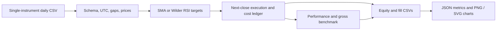

# Strategy Backtest Lab

[](https://github.com/harper698/strategy-backtest-lab/actions/workflows/ci.yml)


**Turn a daily price CSV into an auditable strategy simulation, with explicit execution timing, trading costs, and inspectable performance metrics.**

[中文说明](README.zh-CN.md) · [Execution and metric specification](docs/METHODOLOGY.md) · [Verification](docs/VERIFICATION.md)

This independent portfolio project demonstrates quantitative Python engineering: causal indicators, validation at the data boundary, reproducible accounting, and evidence you can inspect. It includes SMA crossover and Wilder RSI strategies. It makes no profitability claims and does not place orders.

## See the result

**Synthetic daily prices — 300 deterministic observations, not market performance.**


Inspect the [SMA metrics](examples/demo-output/sma/metrics.json), [equity ledger](examples/demo-output/sma/equity.csv), [fills](examples/demo-output/sma/trades.csv), or [RSI report](examples/demo-output/rsi/metrics.json). Every chart has corresponding numerical exports.

## What it handles

- Strict UTC calendar-daily validation: missing dates, duplicates, naive timestamps, and invalid prices fail with a clear message. No silent sorting or forward filling.
- A signal formed at close **t** executes at close **t + 1**. Holdings earn returns only after execution. Tests check future-data changes cannot alter the past.
- Long-only exposure of 0 or 1, with separate fees and proportional slippage charged on each entry and exit.
- Total return, CAGR, maximum drawdown, sample annualized volatility, Sharpe ratio, and an explicitly **gross, cost-free** buy-and-hold benchmark.
- CSV accounting ledgers, strict JSON metrics, and headless PNG/SVG equity and drawdown charts.

**Stack:** Python 3.11+, pandas, NumPy, Matplotlib; pytest and Ruff for verification. All example runs work offline.

## Quick start

```bash
git clone https://github.com/harper698/strategy-backtest-lab.git
cd strategy-backtest-lab
python -m venv .venv
```

Activate with `source .venv/bin/activate` on macOS/Linux, or `.venv\Scripts\Activate.ps1` in Windows PowerShell. If PowerShell blocks activation, run `.venv\Scripts\python -m pip ...` and `.venv\Scripts\backtest-lab ...` directly.

```bash
python -m pip install -e ".[dev]"
backtest-lab --input examples/prices.csv --strategy sma --fast 5 --slow 20 --fee-bps 10 --slippage-bps 5 --output output/sma
backtest-lab --input examples/prices.csv --strategy rsi --rsi-period 14 --rsi-lower 30 --rsi-upper 70 --fee-bps 10 --slippage-bps 5 --output output/rsi
```

Each command writes `equity.csv`, `trades.csv`, `metrics.json`, `equity.png`, and `equity.svg`. Reusing an output directory replaces those report files. Validation errors return exit code **2** before writing a report. No API key, broker account, database, or external data request is needed.

## Input contract

```csv
timestamp,close
2025-01-01T00:00:00+00:00,100.0
2025-01-02T00:00:00+00:00,101.5
```

Supply one instrument, ordered oldest first, with one finite positive close for **every calendar day**. Timestamps are the close observation times, must explicitly include a timezone, and must convert to midnight UTC. Duplicate raw CSV headers also fail. Extra uniquely named columns are ignored. Default SMA(5,20) needs at least 22 prices; RSI(14) needs at least 16.

This version supports a 24/7 daily calendar, suitable for a prepared cryptocurrency series. Equity-market weekends, holidays, splits, dividends, corporate actions, and multi-asset portfolios are outside the input model. `--bars-per-year` changes annualization only; it does not change the calendar validator.

## Execution you can audit

| At close | Event | Return earned through this close |
|---|---|---|
| t | Observe close and form a new target | Position held since close t − 1 |
| t + 1 | Execute the target from t; deduct per-side costs | Position held **before** this new fill |
| t + 2 | First interval return earned by the fill at t + 1 | New position |

The core accounting is small enough to inspect:

```python
position = target.shift(1, fill_value=0)
previous_position = position.shift(1, fill_value=0)
gross_return = previous_position * close.pct_change(fill_method=None).fillna(0)
turnover = (position - previous_position).abs()
net_return = (1 + gross_return) * (1 - turnover * cost_per_side) - 1
```

Here `cost_per_side = (fee_bps + slippage_bps) / 10_000`. Slippage is a proportional equity deduction at the reference close, not a modified execution price. Entry moves all remaining capital into the instrument; exit returns it to cash. Fractional units are implicit. Cash earns zero interest. There is no spread/volume model and no forced liquidation at the end. The final signal has no future bar on which to execute.

`trades.csv` records both `signal_timestamp` and fill `timestamp`, action, reference close, position after fill, separate costs, and equity after fill. `entries` and `exits` count fills; they are not a claim about completed trade win rates. See [the methodology](docs/METHODOLOGY.md) for all formulas and edge cases.

## Python API

```python
from backtest_lab import BacktestConfig, load_prices, run_backtest
from backtest_lab.reporting import write_report

prices = load_prices("examples/prices.csv")
result = run_backtest(prices, BacktestConfig(strategy="sma", fast=5, slow=20))
print(result.metrics["strategy"])
print(result.trades[["signal_timestamp", "timestamp", "action"]])
write_report(result, "output/api-demo")
```

`sma_signal`, `wilder_rsi`, `rsi_signal`, `validate_prices`, and `performance_metrics` are also public. Indicator functions accept a price Series; the engine validates the complete time axis. `performance_metrics` accepts an equity Series **including initial capital as its first row**.

## Architecture



```text
src/backtest_lab/
  data.py        # strict CSV and DataFrame boundary
  strategies.py  # causal SMA and Wilder RSI
  engine.py      # lagged execution and fill accounting
  metrics.py     # interval-aware annualization
  reporting.py   # numerical exports and static charts
  cli.py         # command-line adapter
tests/           # numerical fixtures and behavioral regressions
examples/        # synthetic input and reproducible demonstration outputs
```

## Verify and reproduce

```bash
ruff check .
pytest
python -m build
python scripts/make_example.py
backtest-lab --input examples/prices.csv --strategy sma --output examples/demo-output/sma
backtest-lab --input examples/prices.csv --strategy rsi --output examples/demo-output/rsi
```

The generator uses a documented deterministic formula, with no random seed or downloaded prices. Charts can vary slightly by Matplotlib/font version; the tests verify numerical accounting and report contents, not pixel identity. CI exercises Python 3.11, 3.12, and 3.13. See [verification evidence](docs/VERIFICATION.md) for what was actually run locally.

## Related project

[Market Data Pipeline](https://github.com/harper698/market-data-pipeline) demonstrates ingestion, retries, data quality checks, and SQLite persistence. To connect its wide `closes.csv`, choose one instrument and rename its column to `close`. Its Coinbase candle timestamp marks the **start** of a day: add one day to obtain the close observation time used here, and use only completed candles. Preserve missing values so this backtester can reject gaps instead of inventing data.

## Scope

An educational simulation and engineering demonstration. It does not include live trading, parameter optimization, exchange calendars, leverage, tax accounting, financing costs, market impact, or investment recommendations. The benchmark excludes costs and is labeled accordingly; it is a reference series, not a like-for-like trading implementation.

MIT licensed. Built by [harper698](https://github.com/harper698).
