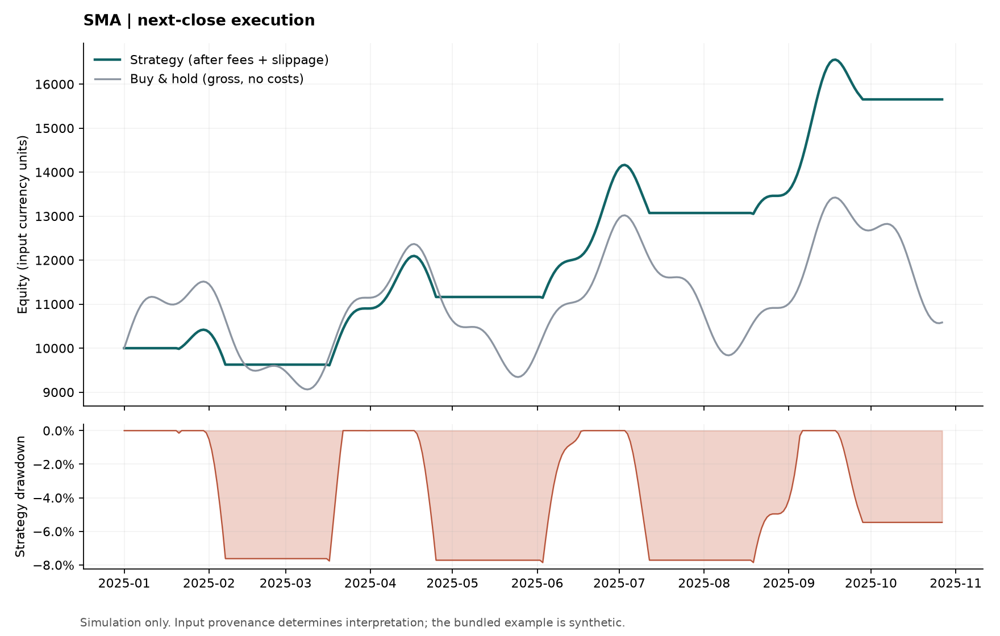

# Strategy Backtest Lab · 轻量策略回测实验室

[](https://github.com/harper698/strategy-backtest-lab/actions/workflows/ci.yml)

**把每日价格 CSV 变成可核对的策略回测报告：明确信号时点、成交时点、交易成本和绩效计算。**

[English](README.md) · [计算口径](docs/METHODOLOGY.md) · [验证记录](docs/VERIFICATION.md)

这是独立开发的作品集项目，用于展示量化 Python 工程能力。实现双均线和 Wilder RSI 两种策略，提供命令行、Python API、交易明细、绩效 JSON 及净值/回撤图。示例使用人工生成的数据，不代表真实投资业绩，也不会连接券商或下单。

## 示例效果

**下图来自 300 天确定性合成数据。**



可直接核对 [SMA 绩效](examples/demo-output/sma/metrics.json)、[每日账本](examples/demo-output/sma/equity.csv)、[成交记录](examples/demo-output/sma/trades.csv) 和 [RSI 绩效](examples/demo-output/rsi/metrics.json)。

## 快速运行

```bash
git clone https://github.com/harper698/strategy-backtest-lab.git
cd strategy-backtest-lab
python -m venv .venv
```

Windows PowerShell 激活：`.venv\Scripts\Activate.ps1`；macOS/Linux 激活：`source .venv/bin/activate`。若 PowerShell 禁止激活，可以直接运行 `.venv\Scripts\python -m pip ...` 和 `.venv\Scripts\backtest-lab ...`。

```bash
python -m pip install -e ".[dev]"
backtest-lab --input examples/prices.csv --strategy sma --fast 5 --slow 20 --fee-bps 10 --slippage-bps 5 --output output/sma
backtest-lab --input examples/prices.csv --strategy rsi --rsi-period 14 --rsi-lower 30 --rsi-upper 70 --fee-bps 10 --slippage-bps 5 --output output/rsi
```

技术栈：Python 3.11+、pandas、NumPy、Matplotlib；测试与静态检查使用 pytest、Ruff。示例完全离线，无需密钥。

| 产物 | 内容 |
|---|---|
| `equity.csv` | 每日价格、指标、信号、成交后仓位、毛/净收益、成本、净值、回撤与基准 |
| `trades.csv` | 信号时间、成交时间、买卖方向、参考收盘价、成本与成交后净值 |
| `metrics.json` | 参数、数据范围、策略绩效、毛收益基准、买卖次数和期末仓位 |
| `equity.png` / `equity.svg` | 净值与回撤图 |

再次使用同一输出目录会覆盖这些报告文件；输入或参数不合法时退出码为 2，在校验通过前不会写报告。

## 明确的输入规则

```csv
timestamp,close
2025-01-01T00:00:00+00:00,100.0
2025-01-02T00:00:00+00:00,101.5
```

- 单一标的，时间已经递增排列，每个自然日一条价格；时间是收盘观察时刻，必须显式携带时区，转换后位于 UTC 零点。
- 价格必须是有限正数。缺失日期、重复时间、重复 CSV 表头、无时区时间、无穷数和空值都会报错。其他不重名列忽略。
- 不自动排序、不填补价格。默认 SMA(5,20) 至少 22 条；RSI(14) 至少 16 条。
- 当前只支持每天都有数据的 24/7 日线日历。股票休市日、复权、分红、公司行为和多资产不在模型范围内。
- `--bars-per-year` 只改变年化系数，不会将校验规则改成交易所日历。默认 365。

## 避免未来数据泄漏的成交模型

| 时点 | 行为 |
|---|---|
| 第 t 天收盘 | 根据已经观察到的价格形成目标仓位 |
| 第 t + 1 天收盘 | 执行上一天信号并扣除成本；此前的日收益仍归旧仓位 |
| 第 t + 2 天收盘 | 新仓位首次获得完整区间收益 |

```python
position = target.shift(1, fill_value=0)
previous_position = position.shift(1, fill_value=0)
gross_return = previous_position * close.pct_change(fill_method=None).fillna(0)
turnover = (position - previous_position).abs()
net_return = (1 + gross_return) * (1 - turnover * cost_per_side) - 1
```

只做多，仓位为 0 或 1，允许隐含的碎股/小数单位。`cost_per_side = (fee_bps + slippage_bps) / 10000`，开仓和平仓分别收费。滑点按净值比例扣减，不修改成交参考价；入场后将扣费剩余资金全部持有标的。现金不计利息。默认期末不强制平仓，最后一根价格产生的信号等待尚不存在的下一根价格。

`entries` / `exits` 是买入/卖出成交次数，不等同于完整交易胜率。买入持有基准使用**未扣费毛收益**，图表与 JSON 均明确标注。

## 指标与测试重点

总收益率、CAGR、最大回撤、年化波动率、夏普比率以账本净值为依据。首行是初始资本，占位收益 0 不参与收益统计；N 行价格使用 N − 1 个实际收益区间。波动率用样本标准差 `ddof=1`，年化无风险利率先复利转换成单日利率。无定义指标输出 JSON `null`，不输出 `NaN` 或 `Infinity`。最大回撤用非正小数表示，例如 `-0.10` 表示回撤 10%。

RSI 用前 period 个涨跌额的简单均值初始化，再使用 Wilder 平滑。预热期间空仓；完全横盘定义为 RSI 50、只涨为 100、只跌为 0。低于下阈值开仓，高于上阈值平仓，中间区间保持原目标。

测试覆盖手算手续费和净值、信号延迟、无未来数据泄漏、预热、零方差、极端数值溢出、不合法数据、年化系数与 CLI。详细公式见 [METHODOLOGY.md](docs/METHODOLOGY.md)。

## API 与复现

```python
from backtest_lab import BacktestConfig, load_prices, run_backtest

prices = load_prices("examples/prices.csv")
result = run_backtest(prices, BacktestConfig(strategy="rsi", rsi_period=14))
print(result.metrics["strategy"])
print(result.trades)
```

```bash
ruff check .
pytest
python -m build
python scripts/make_example.py
backtest-lab --input examples/prices.csv --strategy sma --output examples/demo-output/sma
backtest-lab --input examples/prices.csv --strategy rsi --output examples/demo-output/rsi
```

源码分为数据校验、指标/信号、执行账本、绩效、报告和 CLI 六层。单独公开 `sma_signal`、`wilder_rsi`、`rsi_signal`、`performance_metrics` 等函数，便于复用。CI 配置覆盖 Python 3.11、3.12、3.13；实际本地验证见 [VERIFICATION.md](docs/VERIFICATION.md)。

可与 [Market Data Pipeline](https://github.com/harper698/market-data-pipeline) 配合：从它的宽表 `closes.csv` 选择一个标的并命名为 `close`。Coinbase 日线时间戳代表一天**开始**，需要加一天转换为本项目的收盘观察时间；仅使用已经结束的 K 线，保留缺失值供校验器拒绝。

不包含实盘连接、参数调优、融资成本、市场冲击、税费或投资建议。MIT 开源许可。
